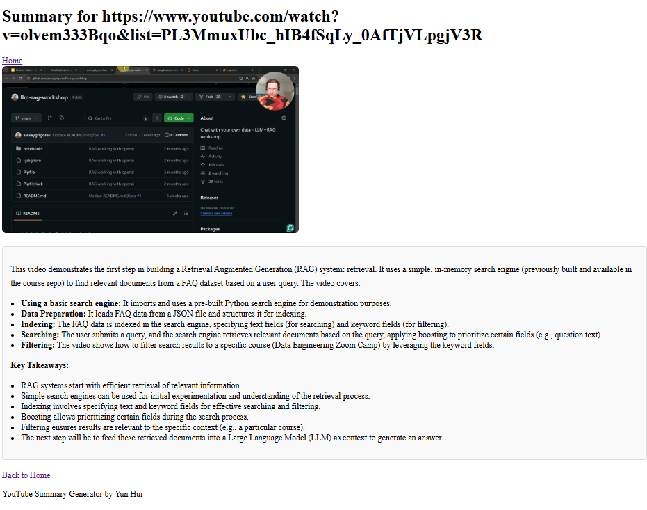

# YouTube Summary App


This Flask-based web application allows users to input a YouTube URL and generates a concise summary of the video's transcript. The app uses the YouTube Transcript API to fetch the transcript and OpenRouter (via LangChain) to generate the summary.




---

## Table of Contents
1. [Prerequisites](#prerequisites)
2. [Setup](#setup)
   - [Create a Conda Environment](#create-a-conda-environment)
   - [Install Dependencies](#install-dependencies)
   - [Set Up OpenRouter API Key](#set-up-openrouter-api-key)
3. [Running the App](#running-the-app)
4. [How It Works](#how-it-works)
5. [File Structure](#file-structure)
6. [Troubleshooting](#troubleshooting)
---

## Prerequisites

Before you begin, ensure you have the following installed:
- [Python 3.8+](https://www.python.org/downloads/)
- [Conda](https://docs.conda.io/projects/conda/en/latest/user-guide/install/) (recommended for environment management)
- [Git](https://git-scm.com/downloads) (optional, for cloning the repository)

---

## Setup

### Create a Conda Environment

Clone the repository (if you haven't already):
```bash
   git clone https://github.com/your-username/youtube-summary-app.git
   cd youtube-summary-app
```

Create a new Conda environment:
```bash
    conda create -n youtube-summary-env python=3.12
    conda activate youtube-summary-env
```
---

### Install Dependencies

Install the required Python packages:
```bash
pip install -r requirements.txt
```
---
## Set Up OpenRouter API Key

To use the OpenRouter API, you need to obtain an API key. Follow these steps:
1. Go to the [OpenRouter API website](https://openrouter.ai/).
2. Sign up or log in to your account.
3. Navigate to the API keys section and generate a new API key.
4. Copy the API key.
5. Create a .env file in the root directory of the project:
    ```bash
    touch .env
    ```
6. Add your OpenRouter API key to the .env file:
    ```bash
    OPENROUTER_API_KEY=your_openrouter_api_key_here
    ```
Note: Do not share your API key publicly. Add .env to your .gitignore file to prevent it from being committed to version control.

---

## Run the Application
1. Activate the Conda environment (if not already activated):
    ```bash
    conda activate youtube-summary-env
    ```
2. Run the Flask app:
    ```bash
    python main.py
    ```
3. Open your browser and navigate to:
    ```bash
    http://127.0.0.1:5000
    ```
    Enter a valid YouTube URL in the input field and click "Generate Summary."

---
### How It Works
1. **YouTube URL Input:**

    The app extracts the video ID from the URL using regex.

2. **Transcript Fetching:**

    The app uses the youtube-transcript-api to fetch the transcript of the video.

3. **Summarization:**

    The transcript is split into semantic chunks using LangChain's SemanticChunker. The app uses OpenRouter (via LangChain) to generate a concise summary of the transcript.

4. **Display:**

    The summary is rendered in Markdown format and displayed on the results page, along with the YouTube thumbnail.

---
## File Structure
```
youtube-summary-app/
│
├── app/
│   ├── create_app.py
│   ├── routes.py
│   ├── utils/
│   │   ├── youtube_utils.py
│   │   ├── summarization.py
│   │   ├── openrouter_client.py
│   ├── templates/
│   │   ├── base.html
│   │   ├── index.html
│   │   ├── summary.html
│   ├── static/
│       ├── css/
│           ├── styles.css
│
├── requirements.txt
├── main.py
├── .env
├── README.md
```
---
## Troubleshooting

### Flask Reloader Issues
If Flask's reloader is causing unnecessary restarts (e.g., due to changes in torch or other libraries), disable debug mode in main.py:

```python
app.run(debug=False)
```

### OpenRouter API Key Not Found
Ensure the .env file is in the root directory and contains the correct OPENROUTER_API_KEY.

### Transcript Not Available

Some YouTube videos do not have transcripts (e.g., music videos or videos with disabled captions). The app will display an error message in such cases.